# Synthex UI Mermaid Documentation

This document captures the repo structure, package boundaries, runtime flows, and release pipeline using Mermaid diagrams.

## Monorepo Package Topology

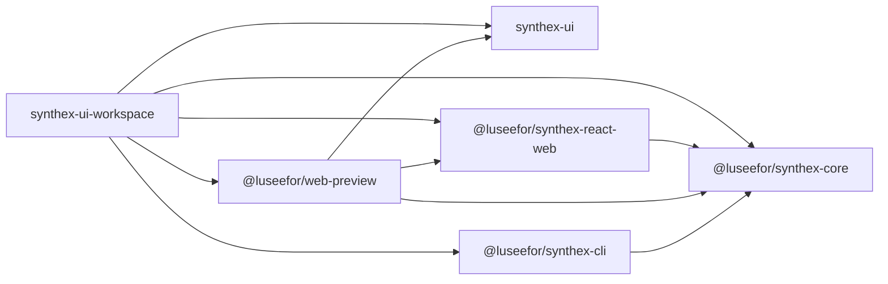

## Public Package Responsibilities

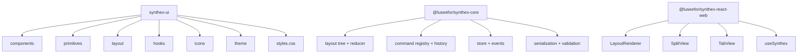

## UI Package Internal Structure

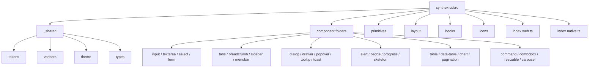

## Theme Resolution Flow

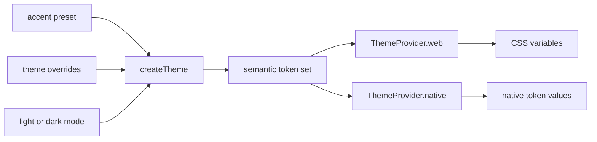

## Layout Engine Model

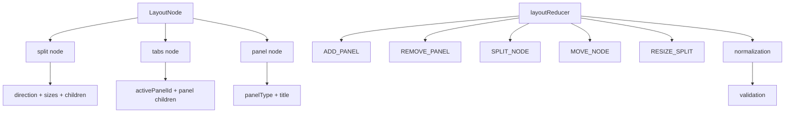

## Workbench Interaction Sequence

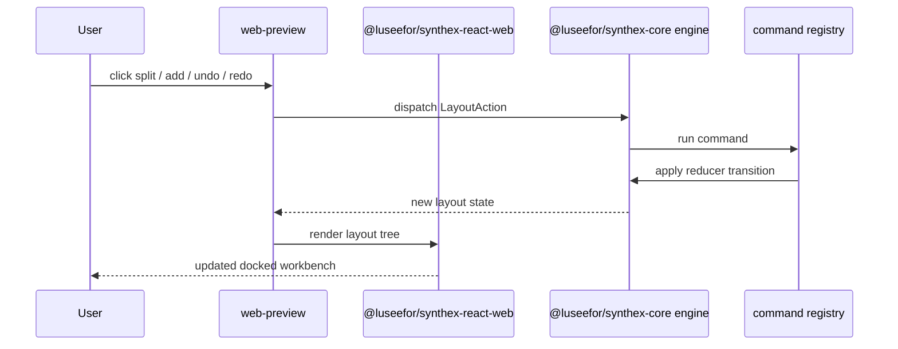

## Preview App Route Map

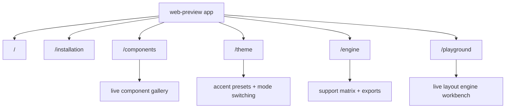

## Release Verification Pipeline

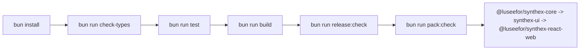

## CI Flow

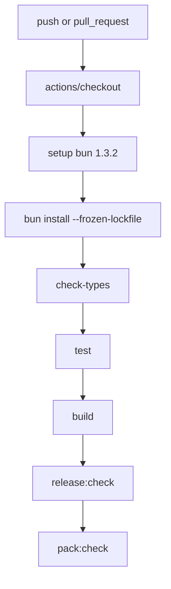

## Package Publish Order

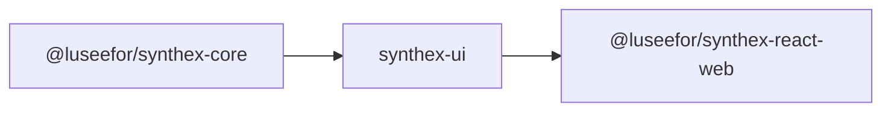

## Consumer Install Matrix

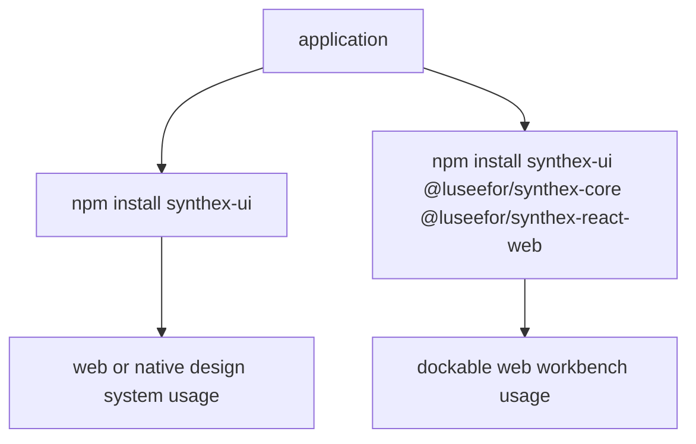
